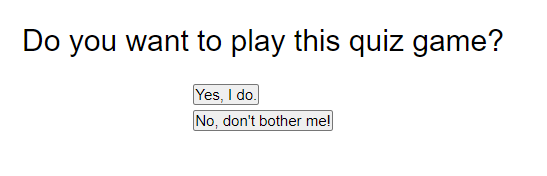
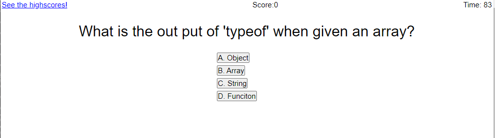
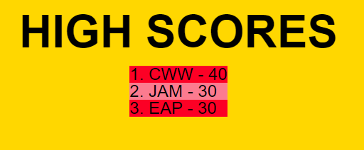

# Quizer

In browser quiz found [here.](https://cwen13.github.io/Quizer/)

## Desription

This is an in browser JavaScript multiple choice quiz game that allows you to 
save your high score session to session. This is accomplished by useing
the localStorage API.

In this game you are presented with the option to play a game or leave. Once 
started there is a timer in the top right corner. Answering a question will 
show if you were correct below the answers as the next question is shown.
When you complete the game you are asked if you would like to play again or to
add your intials with your score to thee high score list.

When playing the game each question is worth 10 points and is added in the score
display in the middle at the top of the page. When you answer a question wrong 
there is a 10 second time penalty.

There is an option to not play the game at the start menu and will repeat the
question to make sure it is what you really want to do. Then leads to a blackout
page showing you have left the game, not for good though just for now.

## Credit

There is some code used from previous tasks in my code camp practice. This is
noted mainly for the bse code fom the timer.

## License

MIT open

## Screen shots

